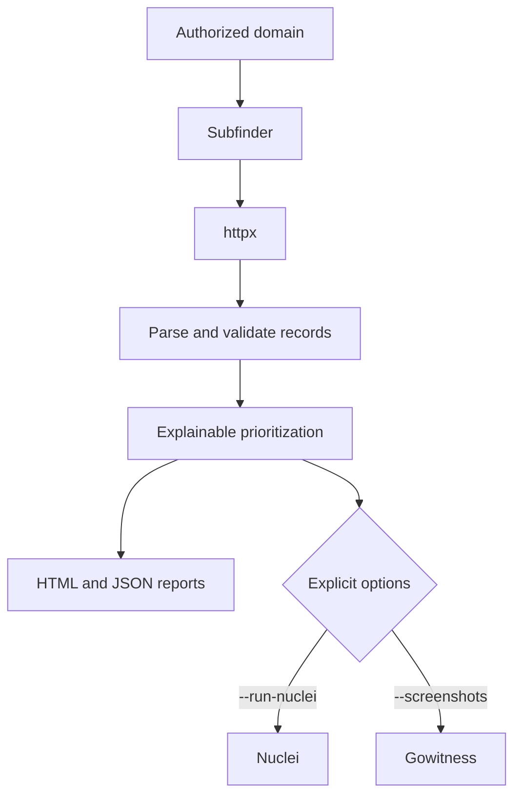

# LordMs Recon

[](https://github.com/Muhammet0-1/LordMs-Recon/actions/workflows/ci.yml)
[](https://www.python.org/)
[](LICENSE)

LordMs Recon is an authorization-first reconnaissance CLI for bug bounty and controlled security assessments. It discovers subdomains, probes reachable HTTP services, produces transparent prioritization signals, and writes HTML and JSON reports for manual review.

> Priority labels are heuristics—not confirmed vulnerabilities, severity ratings, or permission to test a target.

## Highlights

- Subdomain discovery with [Subfinder](https://docs.projectdiscovery.io/opensource/subfinder/overview)
- HTTP metadata collection with ProjectDiscovery [httpx](https://docs.projectdiscovery.io/opensource/httpx/overview)
- Automatic detection of `httpx` and CachyOS/Arch's `httpx-toolkit` executable name
- Explainable scoring based on hostname labels, response status, page title, and content-length outliers
- Escaped, responsive HTML output plus machine-readable JSON
- Optional Nuclei and Gowitness integrations that run only when explicitly requested
- Domain/IDNA validation, safe output paths, subprocess timeouts, and actionable tool errors
- Installable Python package, console entry point, unit tests, and multi-version CI

## Pipeline



## Requirements

- Python 3.10+
- `subfinder`
- `httpx` or `httpx-toolkit`
- Optional: `nuclei`, `gowitness`, Flask

Install external tools from their official documentation. Tool versions and command-line interfaces can change; pin versions you have validated in repeatable environments.

## Installation

```bash
git clone https://github.com/Muhammet0-1/LordMs-Recon.git
cd LordMs-Recon
python3 -m venv .venv
source .venv/bin/activate
python -m pip install --upgrade pip
python -m pip install -e .
```

For the optional local dashboard:

```bash
python -m pip install -e ".[dashboard]"
```

## Usage

Run passive discovery and HTTP probing against a domain for which you have explicit authorization:

```bash
lordms-recon --domain example.com
```

The legacy entry point remains available:

```bash
PYTHONPATH=src python3 recon_prime.py --domain example.com
```

Use a specific HTTP probing executable when auto-detection is not appropriate:

```bash
lordms-recon -d example.com --httpx-bin httpx-toolkit
```

Active integrations are opt-in:

```bash
lordms-recon -d example.com --run-nuclei --rate-limit 25
lordms-recon -d example.com --screenshots
```

See every supported option:

```bash
lordms-recon --help
```

## Output

Each run writes into a domain-specific folder directly below the chosen output root:

```text
recon_example.com/
├── report.html
├── report.json
├── nuclei.txt          # only with --run-nuclei
└── screenshots/        # only with --screenshots
```

The score helps order manual investigation. It does not prove exploitability or business impact.

| Signal | Points |
|---|---:|
| Exact hostname label: `dev`, `test`, `staging`, `admin`, `api`, `beta`, `internal` | +15 each |
| HTTP 401 or 403 | +10 |
| HTTP 5xx | +20 |
| Page title contains `swagger` | +25 |
| Page title contains `index of` | +30 |
| `admin` hostname with HTTP 403 | +20 |
| Content length above mean + 2σ with at least six samples | +20 |

| Score | Priority label |
|---:|---|
| 0–19 | LOW |
| 20–39 | MEDIUM |
| 40–69 | HIGH |
| 70+ | CRITICAL |

## Development

```bash
python -m pip install -e .
python -m compileall -q src recon_prime.py
python -m unittest discover -s tests -v
```

The test suite covers domain and path validation, HTTP record parsing, subprocess failure reporting, scoring, anomaly detection, HTML escaping, and JSON output.

## Responsible use

Use this project only on assets you own or are explicitly authorized to assess. Confirm program scope, automation rules, rate limits, and third-party restrictions before running it. Nuclei and screenshot collection are deliberately disabled unless their flags are supplied.

See [SECURITY.md](SECURITY.md) for vulnerability reporting and [CONTRIBUTING.md](CONTRIBUTING.md) for development guidance.

## License

[MIT](LICENSE) © 2026 Muhammet (LordMs)
