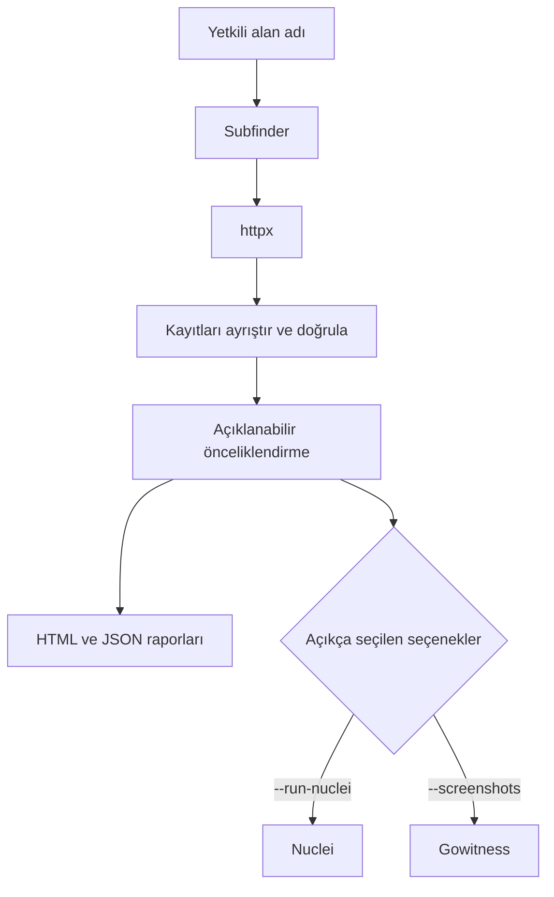

# LordMs Recon

[](https://github.com/Muhammet0-1/LordMs-Recon/actions/workflows/ci.yml)
[](https://www.python.org/)
[](LICENSE)

LordMs Recon; bug bounty ve kontrollü güvenlik değerlendirmeleri için önce yetkilendirmeyi gözeten
bir keşif CLI aracıdır. Alt alan adlarını keşfeder, erişilebilir HTTP servislerini yoklar,
açıklanabilir önceliklendirme sinyalleri üretir ve manuel inceleme için HTML ile JSON raporları
yazar.

> Öncelik etiketleri sezgiseldir; doğrulanmış güvenlik açığı, önem derecesi veya bir hedefi test etme
> izni anlamına gelmez.

## Öne çıkanlar

- [Subfinder](https://docs.projectdiscovery.io/opensource/subfinder/overview) ile alt alan adı keşfi
- ProjectDiscovery [httpx](https://docs.projectdiscovery.io/opensource/httpx/overview) ile HTTP metadata toplama
- `httpx` ile CachyOS/Arch sistemlerindeki `httpx-toolkit` çalıştırılabilir dosya adını otomatik algılama
- Hostname etiketleri, yanıt durumu, sayfa başlığı ve içerik uzunluğu aykırı değerlerine dayalı açıklanabilir puanlama
- Kaçış uygulanmış duyarlı HTML çıktısı ve makine tarafından okunabilir JSON
- Yalnız açıkça istendiğinde çalışan isteğe bağlı Nuclei ve Gowitness entegrasyonları
- Domain/IDNA doğrulama, güvenli çıktı yolları, harici süreç zaman aşımı ve eyleme dönük araç hataları
- Kurulabilir Python paketi, konsol giriş noktası, birim testleri ve çok sürümlü CI

## İşlem hattı



## Gereksinimler

- Python 3.10+
- `subfinder`
- `httpx` veya `httpx-toolkit`
- İsteğe bağlı: `nuclei`, `gowitness`, Flask

Harici araçları resmi belgelerinden kurun. Araç sürümleri ve komut satırı arayüzleri zamanla
değişebilir; tekrarlanabilir ortamlarda doğruladığınız sürümleri sabitleyin.

## Kurulum

```bash
git clone https://github.com/Muhammet0-1/LordMs-Recon.git
cd LordMs-Recon
python3 -m venv .venv
source .venv/bin/activate
python -m pip install --upgrade pip
python -m pip install -e .
```

İsteğe bağlı yerel panel için:

```bash
python -m pip install -e ".[dashboard]"
```

## Kullanım

Pasif keşfi ve HTTP yoklamasını yalnızca açık test izniniz bulunan bir alan adında çalıştırın:

```bash
lordms-recon --domain example.com
```

Eski giriş noktası kullanılmaya devam edilebilir:

```bash
PYTHONPATH=src python3 recon_prime.py --domain example.com
```

Otomatik algılama uygun olmadığında belirli bir HTTP yoklama aracı seçin:

```bash
lordms-recon -d example.com --httpx-bin httpx-toolkit
```

Aktif entegrasyonlar açık onay gerektirir:

```bash
lordms-recon -d example.com --run-nuclei --rate-limit 25
lordms-recon -d example.com --screenshots
```

Desteklenen bütün seçenekler:

```bash
lordms-recon --help
```

## Çıktı

Her çalıştırma, seçilen çıktı kökünün hemen altında alan adına özel bir klasör oluşturur:

```text
recon_example.com/
├── report.html
├── report.json
├── nuclei.txt          # yalnız --run-nuclei ile
└── screenshots/        # yalnız --screenshots ile
```

Puan, manuel inceleme sırasını belirlemeye yardımcı olur. İstismar edilebilirliği veya iş etkisini
kanıtlamaz.

| Sinyal | Puan |
| --- | ---: |
| Tam hostname etiketi: `dev`, `test`, `staging`, `admin`, `api`, `beta`, `internal` | Her biri +15 |
| HTTP 401 veya 403 | +10 |
| HTTP 5xx | +20 |
| Sayfa başlığında `swagger` | +25 |
| Sayfa başlığında `index of` | +30 |
| HTTP 403 döndüren `admin` hostname'i | +20 |
| En az altı örnekte ortalama + 2σ üzerindeki içerik uzunluğu | +20 |

| Puan | Öncelik etiketi |
| ---: | --- |
| 0–19 | LOW |
| 20–39 | MEDIUM |
| 40–69 | HIGH |
| 70+ | CRITICAL |

## Geliştirme

```bash
python -m pip install -e .
python -m compileall -q src recon_prime.py
python -m unittest discover -s tests -v
```

Testler; domain ve yol doğrulamasını, HTTP kayıt ayrıştırmasını, harici süreç hata raporlamasını,
puanlamayı, aykırı değer tespitini, HTML kaçışını ve JSON çıktısını kapsar.

## Sorumlu kullanım

Bu projeyi yalnızca sahibi olduğunuz veya açıkça değerlendirme izni aldığınız varlıklarda kullanın.
Çalıştırmadan önce program kapsamını, otomasyon kurallarını, hız sınırlarını ve üçüncü taraf
kısıtlamalarını doğrulayın. Nuclei ve ekran görüntüsü toplama, ilgili bayraklar sağlanmadıkça kapalıdır.

Güvenlik bildirimi için [SECURITY.md](SECURITY.md), katkı rehberi için
[CONTRIBUTING.md](CONTRIBUTING.md) dosyasına bakın.

## Lisans

[MIT](LICENSE) © 2026 Muhammet (LordMs)
